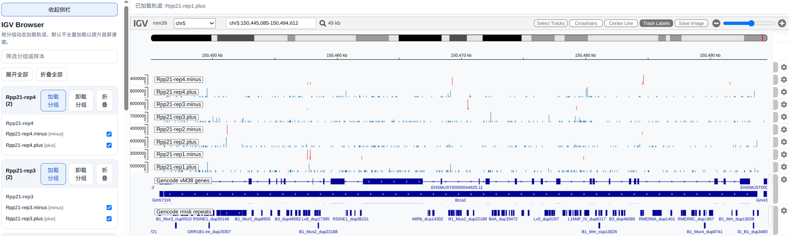

# Omics Workflow

这里是 `Omics` 相关的统一工作流入口。当前目录下的 `run.py` 会根据样本元信息和 `workflow_name` 选择对应的 Snakemake 子流程，并自动生成各流程所需的 `raw.json` 配置文件。

- README.md为人类阅读文档
- 目录名.md为agent加载的skill

snakemake version: >= 9.16.3
## 目录结构

- `run.py`：统一入口脚本，读取元信息、合并配置并调用 Snakemake。
- `run.sh`：当前项目里常用的一键运行示例。
- `config/`：各工作流的模板配置文件。
- `subworkflow/`：各分析流程的 Snakemake 主入口。
- `modules/`：可复用模块定义。
- `example/`：示例配置和示例流程文件。

sample_id不能包含.
## 支持的工作流

`run.py` 通过 `-w/--workflow_name` 选择工作流：

| 工作流 | 说明 | 典型输出 |
| --- | --- | --- |
| `CoCulture` | 共培养样本分析，支持多个物种 | 物种区分后的 BAM、下游统计结果 |
| `MERIP` | MeRIP-seq / m6A-seq 分析 | dedup BAM、peak 结果、IGV 可视化 |
| `RNAseq` | 常规转录组分析 | count 矩阵、TE 表达结果 |
| `CLIP` | iCLIP / CLIP-seq 分析 | 质控、比对、PureCLIP、bedGraph / bigWig、IGV 页面 |
| `Mutation` | 体细胞突变分析（tumor vs normal） | Mutect2 VCF、Spectrum 可视化 |
| `PacVar` | PacBio 长读长变异检测 | 结构变异 VCF、SNP VCF、phasing 结果 |
| `KARRseq` | Kethoxal-Assisted RNA-RNA interaction sequencing | RNA-RNA 相互作用 pairs 文件 |
| `ncRNAseq` | 非编码 RNA 分析 | ncRNA 表达量矩阵 |
| `RNA_SNP` | RNA 变异检测 | SNP/INDEL 结果 |
| `PeakCalling` | ChIP-seq / DIP-seq peak calling 分析 | trimming、bowtie2 比对、MACS3 peak 结果 |
| `QuantMS` | 定量蛋白质组学分析（TMT/LFQ/DIA） | mzTab 定量结果、MSstats 统计分析 |

### CLIP

igv模块准备:

```json
  "igv": {
        "js": "/data/pub/zhousha/Reference/igv.min.js",
        "id": "mm39",
        "name": "Mouse (GRCm39/mm39)",
        "publicPathMap": {
            "/data/pub/zhousha/": "/data/",
            "/data/pub/zhousha/Reference/": "/ref/"
        },
        "fastaURL": "/data/pub/zhousha/Reference/mouse/GENCODE/GRCm39/GRCm39.primary_assembly.genome.fa",
        "indexURL": "/data/pub/zhousha/Reference/mouse/GENCODE/GRCm39/GRCm39.primary_assembly.genome.fa.fai",
        "cytobandURL": "/data/pub/zhousha/Reference/mouse/GENCODE/GRCm39/mm39.cytoBand.txt",
        "tracks": [
            {
                "name": "Gencode vM38 genes",
                "format": "gtf",
                "url": "/data/pub/zhousha/Reference/mouse/GENCODE/GRCm39/gencode.vM38.basic.gene_exon.sorted.gtf.gz",
                "indexUrl": "/data/pub/zhousha/Reference/mouse/GENCODE/GRCm39/gencode.vM38.basic.gene_exon.sorted.gtf.gz.tbi"
            },
            {
                "name": "Gencode rmsk repeats",
                "format": "gtf",
                "url": "/data/pub/zhousha/Reference/mouse/GENCODE/GRCm39/GRCm39_GENCODE_rmsk_TE.sorted.gtf.gz",
                "indexUrl": "/data/pub/zhousha/Reference/mouse/GENCODE/GRCm39/GRCm39_GENCODE_rmsk_TE.sorted.gtf.gz.tbi"
            }
        ]
    }
```
1. 注释轨道

- 注释轨道需要自己建立索引，以防止浏览器全量加载注释卡死（F12观察返回码是否为200,200则是没有配置索引）
```sh
tabix -g gff [gft.gz]
```
- nginx需要确保sendfile是开启状态(on)

2. publicPathMap

为了让nginx能够获取流程生成html内的内容，特意配置了这个map，以生成相对路径让nginx能够读取


## 快速开始

1. 准备输入数据。
   - 如果传入的是元信息文件，通常应包含样本、物种、测序布局等信息。
   - 如果传入的是 fastq 目录，`run.py` 会直接从目录中解析样本信息。
2. 确认 `envs/` 下的 conda 环境已准备好。
3. 使用 `run.py` 启动对应流程。

推荐示例：

```bash
python workflow/RNA-SNP/run.py \
  -m data/meta/fastq \
  -w CLIP \
  -o output \
  -t 48 \
  --log log/CLIP.log \
  --conda-prefix /data/pub/zhousha/env/mutation_0.1 \
  --Params.trim_galore.quality 10
```

如果只是想检查流程而不真正执行，可加上 `--dry-run`。

## `run.py` 参数说明

- `-m, --meta`：元信息文件或 fastq 目录。
- `-w, --workflow_name`：工作流名称，可选 `CoCulture`、`MERIP`、`RNAseq`、`CLIP`、`Mutation`、`PacVar`、`KARRseq`、`PeakCalling`。
- `-o, --output_dir`：输出目录。
- `-t, --threads`：Snakemake 线程数。
- `--dry-run`：只生成计划，不执行。
- `--log`：日志文件路径。
- `--conda-prefix`：conda 包缓存目录。
- `--rerun-trigger`：Snakemake 的重跑触发条件，默认 `input`。可选值及含义：

  | 参数 | 含义 |
  | --- | --- |
  | `code` | rule 定义代码（.smk 文件）发生变化时重跑 |
  | `input` | 输入文件内容（哈希）发生变化时重跑。**需要 `.snakemake/metadata/` 中的历史哈希记录；metadata 为空时无法对比，所有 rule 都会重跑** |
  | `mtime` | 输入文件修改时间比输出文件新时重跑 |
  | `params` | rule 的 params 发生变化时重跑 |
  | `software-env` | conda 环境发生变化时重跑 |

  不指定 `--rerun-trigger` 时，Snakemake 默认使用全部五个触发器。指定 `--rerun-trigger input` 表示**仅**检查 input 内容变化，不检查 code/mtime/params/software-env，更轻量但依赖 metadata。

- `--conda-frontend`：`conda` 或 `mamba`。
- `--snakemake-args`：透传给 Snakemake 的额外参数，放在这个标志后面，例如 `--snakemake-args --keep-going --rerun-incomplete`。

`run.py` 还支持额外参数透传给配置文件：

- `--key value`
- `--key=value`
- 嵌套字段：`--Params.trim_galore.quality 10`

## 输入约定

- 单端文件：通常识别为单个 `fq.gz` / `fastq.gz` 文件。
- 双端文件：通常识别为成对的 `*_1.fq.gz`、`*_2.fq.gz`，或 `*_R1.fq.gz`、`*_R2.fq.gz`。
- `trim_galore` 只是包装命令，实际运行时仍需要 `cutadapt`。
- 如果样本物种名包含空格，配置文件内部会统一规范化，例如 `Mus musculus` -> `Mus_musculus`。

## 输出约定

每次运行都会在 `output/<workflow_name>/` 下生成对应结果，同时写出 `raw.json` 和 `log/` 目录。

对于 `CLIP` 流程，当前还会额外生成：

- `bedtools/`：用于覆盖度和可视化的中间结果。
- `track/igv_track_iclip.html`：可直接打开的 IGV 浏览页面。

其中 `track` 模块会把 bigWig 和参考基因组资源整理成可在浏览器中访问的路径，因此如果在本机或服务器查看 IGV 页面，需要保证这些资源由 nginx 或其他静态服务正确暴露。

## 当前流程特点

- 支持多个工作流统一入口。
- 支持单端和双端测序。
- 配置通过模板 JSON 合并生成，便于复用和覆盖。
- 日志和输出目录由流程自动创建。

## 运行示例

当前仓库中已有的示例脚本可以直接参考 `run.sh`。它对应的典型执行方式是：

```bash
bash workflow/RNA-SNP/run.sh
```

如果需要手动调用 Snakemake，也可以参考 `run.py` 最终拼接出来的命令形式。

## 备注

- `modules/track/README.md` 说明了 IGV / UCSC track 的生成方式。
- `subworkflow/README.md` 说明了各子流程的职责和输入输出。
- 如果后续新增 workflow，建议同步补充：
  - `config/<workflow>.json`
  - `subworkflow/<workflow>.smk`
  - `subworkflow/<workflow>.json`
  `subworkflow/<workflow>.yaml`
  - `run.py` 中的分发逻辑
- 各软件传递参数的默认值均为软件或者适配流程的默认值
- " ".join(cmd)。cmd不能包含None
## 待做

- [ ] 实际执行包装成shell，兼容HPC。简单代码，是放在shell，还是直接在run中运行
- [ ] 元信息待增加分组名
- [x] 添加项目skill文档
- [ ] 整合所有曾经分析过的流程(bcftools待添加进流程)


