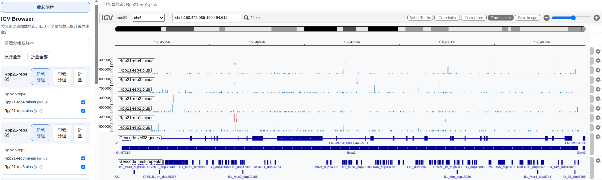

# Omics Workflow

这里是 `Omics` 相关的统一工作流入口。当前目录下的 `run.py` 会根据样本元信息和 `workflow_name` 选择对应的 Snakemake 子流程，并自动生成各流程所需的 `raw.json` 配置文件。

- README.md为人类阅读文档
- 目录名.md为agent加载的skill

snakemake version: >= 9.16.3

## 起因

做这个项目的核心原因，是希望在便于理解的基础上包容更多真实分析场景里的复杂度，并且更好地掌控那些过去已经分析过的流程。

在实际科研工作中，很多流程并不是一次性跑完就结束，而是会不断迭代：样本类型会变化，参数会调整，分析分支会增加，历史流程也常常需要回溯、复现、比较和复用。如果只是追求“先跑通一次”，这些复杂度往往会被分散在脚本、手工记录和临时改动里，后续维护成本会越来越高。`Omics` 想做的是把这些复杂度尽可能收拢到一个统一、可追踪、可扩展的工作流框架里，让过往分析过的流程真正沉淀下来，而不是随着项目结束而散失。

在选型过程中，也比较过主流的流程工具：

- `Snakemake`：规则组织直观，Python 生态结合紧密，适合逐步抽象、持续演化，也更方便对已有分析流程进行细粒度改造和接管。
- `Nextflow`：云原生和大规模调度能力强，社区生态成熟，但在当前场景下，对已有流程做细致接入和日常维护时，心智负担相对更高。
- `Cromwell`：在 WDL 生态下标准化程度高，适合强调任务描述规范和平台化执行的场景，但对我这里这种需要频繁调整、快速迭代和兼容历史分析实现的工作方式来说，不够灵活。

综合比较之后，最终选择了 `Snakemake`。原因不是它在所有场景里都最好，而是它最适合这个项目当前的目标：在保持结构化和可维护性的同时，尽可能包容复杂度，并把过去分析过的流程逐步纳入一个自己能够真正掌控的体系里。

## 目录结构

- `run.py`：统一入口脚本，读取元信息、合并配置并调用 Snakemake。
- `run.sh`：当前项目里常用的一键运行示例。
- `config/`：各工作流的模板配置文件。
- `subworkflow/`：各分析流程的 Snakemake 主入口。
- `modules/`：可复用模块定义。
- `example/`：示例配置和示例流程文件。

sample_id不能包含.
## 支持的工作流

`run.py` 通过 `-w/--workflow_name` 选择工作流：

| 工作流 | 说明 | 典型输出 |
| --- | --- | --- |
| `CoCulture` | 共培养样本分析，支持多个物种 | 物种区分后的 BAM、下游统计结果 |
| `MERIP` | MeRIP-seq / m6A-seq 分析 | dedup BAM、peak 结果、IGV 可视化 |
| `RNAseq` | 常规转录组分析 | count 矩阵、TE 表达结果、融合、差异分析、富集分析、TE嵌合分析 |
| `ncRNAseq` | 非编码 RNA 分析 | ncRNA 表达量矩阵 |
| `CLIP` | iCLIP / CLIP-seq 分析 | 质控、比对、PureCLIP、bedGraph / bigWig、IGV 页面 |
| `Mutation` | 体细胞突变分析（tumor vs normal） | Mutect2 VCF、Spectrum 可视化 |
| `PacVar` | PacBio 长读长变异检测 | 结构变异 VCF、SNP VCF、phasing 结果、端粒长度（4种方法）、着丝粒统计 |
| `KARRseq` | Kethoxal-Assisted RNA-RNA interaction sequencing | RNA-RNA 相互作用 pairs 文件 |
| `PeakCalling` | ChIP-seq / DIP-seq peak calling 分析 | trimming、bowtie2 比对、MACS3 peak 结果 |
| `QuantMS` | 定量蛋白质组学分析（TMT/LFQ/DIA） | mzTab 定量结果、MSstats 统计分析 |
| `tRNAseq` | tRNA 修饰诱导错配测序分析（mim-tRNAseq） | 覆盖度、修饰定量、CCA 分析、DESeq2 差异表达 |
| `scRNAseq` | 单细胞 RNA-seq 分析 | Cell Ranger/STARsolo 比对、scTE TE 定量、Scanpy QC/聚类/注释/高级分析 |
| `Fiberseq` | Fiber-seq 表观遗传分析 | 甲基化检测、染色质可及性分析 |

### CLIP

igv模块准备:

```json
  "igv": {
        "js": "/data/pub/zhousha/Reference/igv.min.js",
        "id": "mm39",
        "name": "Mouse (GRCm39/mm39)",
        "publicPathMap": {
            "/data/pub/zhousha/": "/data/",
            "/data/pub/zhousha/Reference/": "/ref/"
        },
        "fastaURL": "/data/pub/zhousha/Reference/mouse/GENCODE/GRCm39/GRCm39.primary_assembly.genome.fa",
        "indexURL": "/data/pub/zhousha/Reference/mouse/GENCODE/GRCm39/GRCm39.primary_assembly.genome.fa.fai",
        "cytobandURL": "/data/pub/zhousha/Reference/mouse/GENCODE/GRCm39/mm39.cytoBand.txt",
        "tracks": [
            {
                "name": "Gencode vM38 genes",
                "format": "gtf",
                "url": "/data/pub/zhousha/Reference/mouse/GENCODE/GRCm39/gencode.vM38.basic.gene_exon.sorted.gtf.gz",
                "indexUrl": "/data/pub/zhousha/Reference/mouse/GENCODE/GRCm39/gencode.vM38.basic.gene_exon.sorted.gtf.gz.tbi"
            },
            {
                "name": "Gencode rmsk repeats",
                "format": "gtf",
                "url": "/data/pub/zhousha/Reference/mouse/GENCODE/GRCm39/GRCm39_GENCODE_rmsk_TE.sorted.gtf.gz",
                "indexUrl": "/data/pub/zhousha/Reference/mouse/GENCODE/GRCm39/GRCm39_GENCODE_rmsk_TE.sorted.gtf.gz.tbi"
            }
        ]
    }
```
1. 注释轨道

- 注释轨道需要自己建立索引，以防止浏览器全量加载注释卡死（F12观察返回码是否为200,200则是没有配置索引）
```sh
tabix -g gff [gft.gz]
```
- nginx需要确保sendfile是开启状态(on)

2. publicPathMap

为了让nginx能够获取流程生成html内的内容，特意配置了这个map，以生成相对路径让nginx能够读取


## scRNAseq 和空间转录组

### `scRNAseq`

标准 Scanpy 流程从 `.h5ad` 或多个样本 h5ad 开始，规则位于 `modules/scanpy/`，`subworkflow/scRNAseq.smk` 只负责编排。流程包括：

- QC：基因数、线粒体比例、归一化、log1p、高变基因
- 降维和聚类：PCA、neighbors、UMAP、Leiden
- marker 和差异表达
- 可选高级分析：DPT 拟时序、RNA velocity、LIANA 细胞通讯、infercnvpy CNV

最小配置：

```json
{
  "input_h5ad": "/path/input.h5ad",
  "Params": {
    "scanpy": {
      "advanced": {
        "trajectory": true,
        "velocity": false,
        "communication": false,
        "cnv": false
      }
    }
  }
}
```
注意：
aligner: star, counter: scTE
aligner: cellranger, counter: scTE
aligner: cellranger, counter: cellranger
不存在aligner: star counter: star，因为cellranger比对起本身是对star修改而来，而且只接受FASTQ.
所以如果你选择了aligner: cellranger, counter: scTE；虽然使用cellranger比对的，scTE定量，但是cellranger本身进行了定量。建议使用aligner: cellranger, counter: scTE

### `spatial_transcriptomics`

空间转录组流程位于 `subworkflow/spatial_transcriptomics.smk` 和 `modules/spatial_scanpy/`，以 10x Visium 为主，同时支持带 `obsm["spatial"]` 坐标的自定义 spot×gene h5ad。

Visium 输入：

```json
{
  "visium_h5": "/path/filtered_feature_bc_matrix.h5",
  "spatial_dir": "/path/spatial"
}
```

自定义 h5ad 输入：

```json
{
  "input_h5ad": "/path/spatial.h5ad"
}
```

流程包括空间 QC、归一化、高变基因、PCA、空间聚类、空间 marker、Squidpy 空间邻域和 Moran's I 空间自相关。cell2location 依赖已在环境模板中预留，但只有在明确参考 scRNA 表达矩阵和细胞类型 signature 输入后才应启用。

## 快速开始

1. 准备输入数据。
   - 如果传入的是元信息文件，通常应包含样本、物种、测序布局等信息。
   - 如果传入的是 fastq 目录，`run.py` 会直接从目录中解析样本信息。
2. 准备运行环境：选择 conda 模式或容器（Apptainer/SIF）模式。
   - **conda 模式**：需指定 `--conda-prefix`，`run.py` 会自动添加 `--use-conda`。
   - **容器模式**：指定 `--sdm`，`run.py` 会省略 `--use-conda`，改为让 Snakemake 用 `container:` 指令解析的 SIF 镜像运行。SIF 镜像由 `EnvUtil.py` 从 conda yaml 生成（见 `src/common/util/EnvUtil.py`），`common.smk` 的 `sif()` 函数根据 yaml 文件名 stem 查找路径。
3. 使用 `run.py` 启动对应流程。

推荐示例（conda 模式）：

```bash
python workflow/Omics/run.py \
  -m data/meta/fastq \
  -w CLIP \
  -o output \
  -t 48 \
  --log log/CLIP.log \
  --conda-prefix /data/pub/zhousha/env/mutation_0.1 \
  --Params.trim_galore.quality 10
```

容器模式示例：

```bash
python workflow/Omics/run.py \
  -m data/meta/fastq \
  -w CLIP \
  -o output \
  -t 48 \
  --sdm \
  --rerun-triggers mtime
```

容器模式下 `run.py` 会自动从配置 JSON 中提取路径并生成 `--singularity-args --bind ...`，
无需手动指定。如需覆盖，用 `--singularity-args`。

如果只是想检查流程而不真正执行，可加上 `--dry-run`。

### Apptainer 容器模式详解

#### 原理

每个模块的 conda 环境 YAML（`modules/<module>/<name>.yaml`）可构建为 Apptainer SIF 镜像。Snakemake 通过 `container:` 指令在运行时自动调用对应的 SIF。

#### 构建 SIF 镜像

使用 `EnvUtil.py` 从 conda YAML 生成 `.def` 文件并构建 `.sif`：

```bash
# 生成 .def 文件（不构建）
python workflow/Omics/src/common/util/EnvUtil.py gen \
  --modules-dir workflow/Omics/modules \
  --outdir /path/to/env

# 构建已有 .def 文件为 .sif
python workflow/Omics/src/common/util/EnvUtil.py build \
  --modules-dir workflow/Omics/modules \
  --outdir /path/to/env

# 完整流程：YAML → .def → .sif（推荐）
python workflow/Omics/src/common/util/EnvUtil.py all \
  --modules-dir workflow/Omics/modules \
  --outdir /path/to/env
```

构建后的 SIF 存放结构：
```
/path/to/env/
  bowtie2/
    bowtie2.sif
  macs3/
    macs3.sif
  fastqc/
    fastqc.sif
  ...
```

#### SIF 路径解析

`common.smk` 中的 `sif()` 函数负责路径解析：

```python
# modules/common/common.smk
def sif(yaml_filename: str) -> str:
    """根据 config["env"] 映射查找 SIF 路径"""
```

配置 JSON 中的 `env` 字段建立 YAML stem → SIF 路径的映射：

```json
{
  "env": {
    "env_dir": "/path/to/env",
    "bowtie2": "/path/to/env/bowtie2/bowtie2.sif",
    "macs3": "/path/to/env/macs3/macs3.sif"
  }
}
```

未显式映射的模块会自动回退到 `<env_dir>/<module>/<yaml_stem>.sif`。

#### Bind 路径自动推导

`run.py --sdm` 模式下，`_collect_bind_paths()` 会递归扫描配置 JSON 中的所有路径字符串，自动推导需要 bind-mount 的目录列表，并合并父目录以最小化 bind 数量。

自动 bind 包含：
- 输入数据目录（raw FASTQ 路径）
- 输出目录
- 参考基因组目录
- 软件/env 目录
- `/tmp`（临时文件）

如需额外 bind 路径：

```bash
python workflow/Omics/run.py \
  -m data/meta.tsv -w PeakCalling -o output \
  --sdm \
  --singularity-args '--bind /extra/data,/extra/ref'
```

#### 手动运行 Snakemake + Apptainer

不通过 `run.py`，直接调用 Snakemake：

```bash
snakemake -s workflow/Omics/subworkflow/PeakCalling.smk \
  --configfile output/Rnp/PeakCalling/raw.json \
  --cores 48 \
  --sdm apptainer \
  --singularity-args '--bind /data,/home/user/Database,/home/user/Data,/tmp' \
  --rerun-triggers code input mtime params software-env
```

#### 常见问题

- **`command not found`**：SIF 内的工具不在 PATH 中，检查 `.def` 文件的 `%environment` 或 `%post` 段是否正确设置了 PATH。
- **权限错误**：确保 `--bind` 的目标目录对当前用户可读写。
- **SIF 过期**：conda YAML 更新后需重新构建 SIF（`EnvUtil.py all`）。

#### Apptainer 直接执行命令

SIF 镜像内的工具可直接通过 `apptainer exec` 调用，无需经过 Snakemake。每个 SIF 的 `%runscript` 设置为 `exec "$@"`，因此传入的命令会直接执行。

基本语法：

```bash
apptainer exec \
  --bind /data,/home/user/Database,/tmp \
  /path/to/env/<module>/<module>.sif \
  <tool> [arguments...]
```

常用工具示例：

```bash
BIND="--bind /home/luosg/Data,/home/luosg/Database,/tmp"
ENV="/home/luosg/Database/env"

# FastQC 质控
apptainer exec $BIND $ENV/fastqc/fastqc.sif \
  fastqc --threads 8 -o output/QC/ sample_1.fq.gz sample_2.fq.gz

# Trim Galore 接头修剪
apptainer exec $BIND $ENV/trim-galore/trim-galore.sif \
  trim_galore --quality 25 --paired -o output/trimmed/ sample_1.fq.gz sample_2.fq.gz

# Bowtie2 比对
apptainer exec $BIND $ENV/bowtie2/bowtie2.sif \
  bowtie2 -x /path/to/index -1 sample_1.fq.gz -2 sample_2.fq.gz --very-sensitive -S output.sam

# SAMtools 处理
apptainer exec $BIND $ENV/samtools/samtools.sif \
  samtools sort -@ 8 -o output.bam input.sam

# GATK MarkDuplicates
apptainer exec $BIND $ENV/gatk/gatk4.sif \
  gatk MarkDuplicates -I input.bam -O output.bam -M metrics.txt

# MACS3 Peak Calling
apptainer exec $BIND $ENV/macs3/macs3.sif \
  macs3 callpeak -t IP.bam -c Input.bam -f BAM -g mm -n sample --outdir peaks/

# HOMER 注释
apptainer exec $BIND $ENV/homer/homer.sif \
  annotatePeaks.pl peaks.narrowPeak mm39 -gtf annotation.gtf > annotation.txt

# BEDTools 交集
apptainer exec $BIND $ENV/bedtools/bedtools.sif \
  bedtools intersect -a peaks.bed -b TE.gtf -wa -wb > overlap.bed

# deeptools computeMatrix
apptainer exec $BIND $ENV/deeptools_heatmap/deeptools_heatmap.sif \
  computeMatrix reference-point -S signal.bigwig -R peaks.bed -a 3000 -b 3000 -o matrix.gz

# deeptools plotHeatmap
apptainer exec $BIND $ENV/deeptools_heatmap/deeptools_heatmap.sif \
  plotHeatmap -m matrix.gz -o heatmap.png --whatToShow 'heatmap and colorbar'

# FRiP score 计算（bedtools + samtools 组合）
apptainer exec $BIND $ENV/samtools/samtools.sif \
  samtools view -c -F 4 aligned.bam  # 总 mapped reads
apptainer exec $BIND $ENV/bedtools/bedtools.sif \
  bedtools intersect -a aligned.bam -b peaks.bed -u | samtools view -c  # peaks 内 reads
```

调试容器内部环境：

```bash
# 进入容器交互式 shell
apptainer shell --bind /home/luosg/Data,/home/luosg/Database,/tmp \
  /home/luosg/Database/env/bowtie2/bowtie2.sif

# 查看容器内可用命令
apptainer exec $ENV/bowtie2/bowtie2.sif which bowtie2
apptainer exec $ENV/bowtie2/bowtie2.sif bowtie2 --version
```

### 测试模式（`--test`）

`run.py` 支持内置测试模式，用于快速检查某个工作流是否能正确解析配置、生成 `raw.json` 并完成 Snakemake dry-run。

```bash
# 测试单个工作流
python workflow/Omics/run.py \
  --test ncRNAseq \
  -o output

# 测试所有工作流
python workflow/Omics/run.py \
  --test all \
  -o output
```

测试模式会自动：
- 使用 `workflow/Omics/assests/test/meta_<workflow>.tsv`
- 从 `workflow/Omics/assests/test/data/` 生成测试路径
- 输出到 `output/test/`（或你指定的输出目录下的 `test/`）
- 开启 `--dry-run`
- 使用本地 `.conda` 前缀，避免污染共享环境

如果某个工作流没有对应的测试 meta 文件，`run.py` 会跳过该工作流并提示警告。

## 运行特定步骤

`run.py` 提供 `--forcerun` 和 `--target-jobs` 参数，用于精确重跑特定规则。

### `--forcerun`：强制重跑规则

接受规则名或文件路径，内部转换为 snakemake 的 `--until` + `--forcerun`。

```bash
# 重跑某个规则（所有 wildcards）
python workflow/Omics/run.py \
  -m data/meta.tsv -w RNAseq -o output --sdm \
  --forcerun function_gsea

# 重跑文件路径对应的规则
python workflow/Omics/run.py \
  -m data/meta.tsv -w RNAseq -o output --sdm \
  --forcerun /path/to/output/some_file.txt

# 同时重跑多个规则
python workflow/Omics/run.py \
  -m data/meta.tsv -w RNAseq -o output --sdm \
  --forcerun trimming_Paired function_gsea
```

规则名自动补全：subworkflow 中通过 `use rule ... as <WorkflowName>_...` 重命名了规则。`run.py` 会自动补前缀，用户只需写原始规则名：

| 用户输入 | 自动转换为 |
| --- | --- |
| `function_gsea` | `RNAseq_function_gsea` |
| `RNAseq_function_gsea` | `RNAseq_function_gsea`（已带前缀，不变） |
| `all` | `all`（特殊规则名，不变） |
| `/path/to/file` | `/path/to/file`（文件路径，不加前缀） |

### `--target-jobs`：按 wildcard 约束定位 job

用于重跑特定 wildcard 组合的 job，格式为 `RULE:WILDCARD1=VALUE,...`。规则名自动加前缀。

```bash
# 重跑 scTE counter 的所有 scanpy QC job
python workflow/Omics/run.py \
  -m data/meta.tsv -w scRNAseq -o output --sdm \
  --counters scTE --aligner cellranger \
  --forcerun scanpy_qc \
  --target-jobs scanpy_qc:counter=scTE,sample_id=S1

# 重跑特定 tissue 的所有 scanpy cluster job
python workflow/Omics/run.py \
  -m data/meta.tsv -w scRNAseq -o output --sdm \
  --counters scTE --aligner cellranger \
  --forcerun scanpy_cluster \
  --target-jobs scanpy_cluster:counter=scTE,tissue=ovaries
```

`--target-jobs` 需要指定完整的 wildcard 值。如果规则有多个 wildcard（如 `{sample_id}` 和 `{counter}`），必须全部指定。配合 `--forcerun` 使用，`--target-jobs` 负责筛选，`--forcerun` 负责强制重跑。

### `--touch`：更新输出文件时间戳

```bash
# 标记所有输出为最新（不实际运行）
python workflow/Omics/run.py \
  -m data/meta.tsv -w RNAseq -o output --sdm \
  --touch
```

`--touch` 和 `--dry-run` 不能同时使用，同时指定时会输出警告并忽略 `--touch`。

### 查看 DAG 和调试

```bash
# 查看将要执行的 job(配合 --dry-run)
python workflow/Omics/run.py \
  -m data/meta.tsv -w RNAseq -o output --sdm \
  --forcerun function_gsea --dry-run

# 透传其他 snakemake 参数
python workflow/Omics/run.py \
  -m data/meta.tsv -w RNAseq -o output --sdm \
  --forcerun function_gsea \
  --snakemake-args --printshellcmds

# 生成 DAG 图
snakemake -s workflow/Omics/subworkflow/RNAseq.smk \
  --configfile output/RNAseq/raw.json \
  --cores 1 --sdm apptainer \
  --until RNAseq_function_gsea --forcerun RNAseq_function_gsea \
  --dag | dot -Tpng > dag.png
```

### 跳过指定规则

如需跳过某个规则及其下游,可通过 `--snakemake-args` 透传 snakemake 的 `--omit-from`:

```bash
python workflow/Omics/run.py \
  -m data/meta.tsv -w RNAseq -o output --sdm \
  --snakemake-args --omit-from RNAseq_generate_report
```

## `run.py` 参数说明

- `-m, --meta`：元信息文件或 fastq 目录。
- `-w, --workflow_name`：工作流名称，可选 `CoCulture`、`MERIP`、`RNAseq`、`ncRNAseq`、`CLIP`、`Mutation`、`PacVar`、`KARRseq`、`PeakCalling`、`QuantMS`、`tRNAseq`、`scRNAseq`、`Fiberseq`。
- `-o, --output_dir`：输出目录。
- `-t, --threads`：Snakemake 线程数。
- `--dry-run`：只生成计划，不执行。
- `--log`：日志文件路径。
- `--conda-prefix`：conda 包缓存目录（conda 模式必需，容器模式下省略）。
- `--sdm`：使用 Apptainer 容器后端（SIF 镜像）。设置后 `run.py` 不添加 `--use-conda`，改用 `container:` 指令解析的 SIF 运行。自动从配置 JSON 提取路径生成 `--singularity-args --bind ...`。
- `--singularity-args`：手动指定 singularity/apptainer 参数，如 `--singularity-args '--bind /path1,/path2'`（与 `--sdm` 配合使用，覆盖自动生成的 bind 列表）。
- `--rerun-trigger`：Snakemake 的重跑触发条件，默认 `input`。可选值及含义：

  | 参数 | 含义 |
  | --- | --- |
  | `code` | rule 定义代码（.smk 文件）发生变化时重跑 |
  | `input` | 输入文件内容（哈希）发生变化时重跑。**需要 `.snakemake/metadata/` 中的历史哈希记录；metadata 为空时无法对比，所有 rule 都会重跑** |
  | `mtime` | 输入文件修改时间比输出文件新时重跑 |
  | `params` | rule 的 params 发生变化时重跑 |
  | `software-env` | conda 环境发生变化时重跑 |

  不指定 `--rerun-trigger` 时，Snakemake 默认使用全部五个触发器。指定 `--rerun-trigger input` 表示**仅**检查 input 内容变化，不检查 code/mtime/params/software-env，更轻量但依赖 metadata。

- `--conda-frontend`：`conda` 或 `mamba`。
- `--forcerun`：强制重跑指定规则或文件路径，格式：`RULE` 或 `/path/to/file`。规则名自动加 workflow 前缀。
- `--target-jobs`：按 wildcard 约束定位 job，格式：`RULE:WILDCARD1=VALUE,...`。配合 `--forcerun` 使用。
- `--touch`：更新输出文件时间戳，不实际运行。与 `--dry-run` 冲突。
- `--no-schema-validate`：禁用 schema 感知的 extra_args 类型矫正（默认启用）。
- `--snakemake-args`：透传给 Snakemake 的额外参数，放在这个标志后面，例如 `--snakemake-args --keep-going --rerun-incomplete`。

`run.py` 还支持额外参数透传给配置文件：

- `--key value`
- `--key=value`
- 嵌套字段：`--Params.trim_galore.quality 10`

## 输入约定

- 单端文件：通常识别为单个 `fq.gz` / `fastq.gz` 文件。
- 双端文件：通常识别为成对的 `*_1.fq.gz`、`*_2.fq.gz`，或 `*_R1.fq.gz`、`*_R2.fq.gz`。
- `trim_galore` 只是包装命令，实际运行时仍需要 `cutadapt`。
- 如果样本物种名包含空格，配置文件内部会统一规范化，例如 `Mus musculus` -> `Mus_musculus`。

## 输出约定

每次运行都会在 `output/<workflow_name>/` 下生成对应结果，同时写出 `raw.json` 和 `log/` 目录。

对于 `CLIP` 流程，当前还会额外生成：

- `bedtools/`：用于覆盖度和可视化的中间结果。
- `track/igv_track_iclip.html`：可直接打开的 IGV 浏览页面。

其中 `track` 模块会把 bigWig 和参考基因组资源整理成可在浏览器中访问的路径，因此如果在本机或服务器查看 IGV 页面，需要保证这些资源由 nginx 或其他静态服务正确暴露。

## 当前流程特点

- 支持多个工作流统一入口。
- 支持单端和双端测序。
- 配置通过模板 JSON 合并生成，便于复用和覆盖。
- 日志和输出目录由流程自动创建。
- **RNAseq 支持多基因组并行分析**：同一次运行中，不同物种的样本自动路由到各自的参考基因组，共享 trim → align → quant → report 的 DAG，无需拆分物种单独执行。
  - 物物种别名自动解析（`mouse` → `GRCm39`，`human` → `GRCh38`，`rhesus` → `Mmul_10`），见 `src/common/util/type.py` 的 `SPECIES_TO_GENOME`。
  - 所有涉及参考基因组的 module 均提供 `polygenomes/` 子模块，通过 `{genome}` wildcard 在同一 DAG 中处理多物种。
  - node.py 按 organism 分组注入 `genome_paired_samples` / `genome_single_samples`，DESeq2 group_pairs 按物种隔离，RNAseq_report 每物种独立生成一份 PPT。

## 运行示例

当前仓库中已有的示例脚本可以直接参考 `run.sh`。它对应的典型执行方式是：

```bash
bash workflow/RNA-SNP/run.sh
```

如果需要手动调用 Snakemake，也可以参考 `run.py` 最终拼接出来的命令形式。

## 备注

- `modules/track/README.md` 说明了 IGV / UCSC track 的生成方式。
- `subworkflow/README.md` 说明了各子流程的职责和输入输出。
- 如果后续新增 workflow，建议同步补充：
  - `config/<workflow>.json`
  - `config/<workflow>.schema.json`
  - `subworkflow/<workflow>.smk`
  - `subworkflow/<workflow>.json`
  - `subworkflow/<workflow>.yaml`
  - `run.py` 中的分发逻辑
- 各软件传递参数的默认值均为软件或者适配流程的默认值
- " ".join(cmd)。cmd不能包含None
## 待做

- [x] 实际执行包装成shell，兼容HPC
- [x] 完善meta设计
- [x] 添加项目skill文档
- [x] 整合所有曾经分析过的流程
- [x] 添加json值校验模块
- [x] schema感知的extra_args类型矫正
- [x] RNAseq 多基因组并行支持（polygenomes 子模块 + 按物种注入 config）
- [ ] ncRNAseq 多基因组改造（star_3pass polygenomes 已就绪，subworkflow/node.py 待接入）
- [ ] CLIP 多基因组改造（star/bowtie2/PureCLIP polygenomes 已就绪）
- [ ] MERIP 多基因组改造
- [ ] Mutation 多基因组改造（bwa-mem2/gatk/manta/cnvkit/spectrum polygenomes 已就绪）
- [ ] PacVar 多基因组改造（pbmm2/deepvariant/hiphase/pbsv/trgt polygenomes 已就绪）
- [ ] PeakCalling 多基因组改造（bowtie2/macs3/homer/deeptools polygenomes 已就绪）
- [ ] scRNAseq 多基因组改造（cellranger/scTE polygenomes 已就绪）
- [ ] tRNAseq 多基因组改造（mimseq polygenomes 已就绪）
- [ ] QuantMS 多基因组改造（openms polygenomes 已就绪）
- [ ] KARRseq 多基因组改造
- [ ] Fiberseq 多基因组改造（fibertools polygenomes 已就绪）
- [ ] CoCulture 流程适配 polygenomes 模式（当前走独立 disambiguate 路径）
- [ ] ncRNAseq_report / PeakCalling_report 多基因组改造


